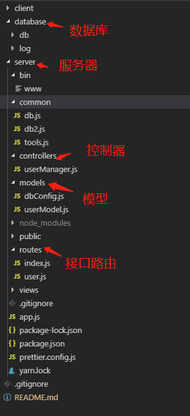
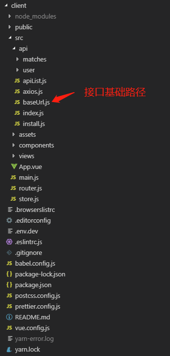

# node express + MongoDB + vue 项目实战

## 一、软件安装：

### 1、安装 node

[官网安装](https://nodejs.org/en/)
[Node.js 安装及环境配置之 Windows 篇](https://www.cnblogs.com/zhouyu2017/p/6485265.html)

[Mac 下 node 安装和环境配置详解（最新）](https://blog.csdn.net/m0_37896739/article/details/83545890)

### 2、安装 MongoDB

官网下载对应版本：[MongoDB Download](https://www.mongodb.com/download-center/community)

[MongoDB 设置环境变量与设置成 Windows 服务](https://blog.csdn.net/lxd8731247769/article/details/51201024)

[MongoDB 数据库安装及配置环境(windows10 系统)](https://www.cnblogs.com/tim100/p/6721415.html)

#### 命令行下运行 MongoDB 服务器

> 配置 MongoDB 服务器从 bin 目录中执行 mongod.exe 文件：

```
$ C:\Program Files\MongoDB\Server\4.0\bin --dbpath D:\git\code\node-vue\database\db
```

#### 连接 MongoDB

> 在命令窗口中运行 mongo.exe 命令即可连接上 MongoDB:

```
$ C:\Program Files\MongoDB\Server\4.0\bin\mongo.exe
```

#### 配置 MongoDB 服务

> 管理员模式打开命令行窗口，创建目录，执行下面的语句来创建数据库和日志文件的目录

```
$ mkdir D:\git\code\node-vue\database\db
$ mkdir D:\git\code\node-vue\database\log
```

> 创建配置文件，该文件必须设置 systemLog.path 参数，包括一些附加的配置选项更好。

> 例如，创建一个配置文件位于 C:\mongodb\mongod.cfg，其中指定 systemLog.path 和 storage.dbPath。具体配置内容如下：

```
systemLog:
    destination: file
    path: D:\git\code\node-vue\database\log\mongod.log
storage:
    dbPath: D:\git\code\node-vue\database\db
```

#### 安装 MongoDB 服务

> 通过执行 mongod.exe，使用--install 选项来安装服务，使用--config 选项来指定之前创建的配置文件:

```
$ C:\Program Files\MongoDB\Server\4.0\bin\mongod.exe --config "C:\Program Files\MongoDB\Server\4.0\bin\mongod.cfg" --install
```

### 命令行工具下，管理员模式启动 MongoDB 服务

```
$ net start MongoDB
```

### 命令行工具下，管理员模式关闭 MongoDB 服务

```
$ net stop MongoDB
```

### 命令行工具下，管理员模式移除 MongoDB 服务

```
$ C:\Program Files\MongoDB\Server\4.0\bin\mongod.exe --remove
```

### 安装 MongoBD Compass 可视化工具

[MongoDB Compass 下载链接](https://www.mongodb.com/dr/fastdl.mongodb.org/win32/mongodb-win32-x86_64-2008plus-ssl-4.0.10-signed.msi/download)

### 3、安装 vue and vue-cli3

> 安装 vue 最新稳定版

```
$ npm install vue
```

> 安装 vue-cli3

```
npm install -g @vue/cli
# OR
yarn global add @vue/cli
```

> 使用 vue serve 和 vue build 命令对单个 \*.vue 文件进行快速原型开发，不过这需要先额外安装一个全局的扩展：

```
$ npm install -g @vue/cli-service-global
```

## 二、搭建基于 node express 环境的 server

### 1、新建项目

> 通过应用生成器工具 express-generator 可以快速创建一个应用的骨架。
> express-generator 包含了 express 命令行工具。通过如下命令即可安装：

```
$ npm install express-generator -g
```

> 创建了一个名称为 server 的 Express 应用。此应用将在当前目录下的 server 目录中创建，并且设置为使用 jade 模板引擎（view engine）：

```
$ cd D:\git\code\node-vue
$ express --view=jade server
```

### 2、安装所有依赖包：

```
$ cd sever
$ npm install
```

### 3、修改 server 默认端口号为 4000

> 打开 bin/www 文件，找到如下代码进行修改

```
/**
 * Get port from environment and store in Express.
 */
var port = normalizePort(process.env.PORT || '3000'); // 此处改为4000
app.set('port', port);
```

### 运行 server

> visit:http://localhost:4000/

```
$ cd server
$ npm start
```

## 三、搭建基于 vue cli 3 环境的 client

### 1、新建项目

> Vue 提供了一个官方的 CLI，为单页面应用 (SPA) 快速搭建繁杂的脚手架。它为现代前端工作流提供了 batteries-included 的构建设置。只需要几分钟的时间就可以运行起来并带有热重载、保存时 lint 校验，以及生产环境可用的构建版本

```
$ cd D:\git\code\node-vue
$ vue create client
```

### 2、安装所有依赖包：

```
$ cd client
$ npm install
```

### 3、client 根目录新建并配置 vue.config.js

```
module.exports = {
    publicPath: '/', // 配置路由基础路径， history 模式需使用绝对路径
    outputDir: 'dist',
    lintOnSave: true,
    productionSourceMap: false,
    configureWebpack: {
        // webpack 配置
        output: {
            // 输出重构  打包编译后的 文件名称
            filename: `js/[name].js?${Math.random()}`,
            chunkFilename: `js/[name].js?${Math.random()}`
        }
    },
    css: {
        // 是否使用css分离插件 ExtractTextPlugin
        extract: true,
        // 开启 CSS source maps?
        sourceMap: false,
        loaderOptions: {}
    },
    devServer: {
        open: true,
        host: '0.0.0.0',
        port: 10086,
        https: false,
        hotOnly: false,
        proxy: null,
        // proxy: {
        //     '/api': {
        //         target: '<url>',
        //         ws: true,
        //         changOrigin: true
        //     }
        // },
        before: (app) => {}
    }
}

```

### 4、运行 client

> visit client:http://localhost:10086/

```
$ cd client
$ npm run serve
```

---

做到这里，我们的后端服务器、前端架构就搭建完成了，接下来就是在 server 上连接到 MongoDB 数据库、开发后端 API 接口。然后并在 client 中使用并调试 server 提供的接口。

## 四、使用 MongoDB Shell 创建数据库 node-vue

> 启动 MongoDB 服务：使用 net start MongoDB 命令，或在 MongoDB 安装目录的 bin 目录下执行 mongod.exe 文件

```
$ net start MongoDB // 启动MongoDB 服务或在bin目前下运行mongod.exe
$ cd C:\Program Files\MongoDB\Server\4.0\bin // 进入mongoDB安装的bin目录
$ mongo.exe // 通过 shell 连接 MongoDB 服务

MongoDB shell version v4.0.9
connecting to: mongodb://127.0.0.1:27017/?gssapiServiceName=mongodb
Implicit session: session { "id" : UUID("de700974-938d-4106-9fbc-40ad77a202c9") }
MongoDB server version: 4.0.9
Welcome to the MongoDB shell.
...
```

> shell 模式下，输入 exit 返回，输入 mongod.exe 查看连接信息

```
$ mongod.exe // 查看从哪里连接到MongoDB的服务器

2019-07-08T16:10:56.384+0800 I CONTROL  [main] Automatically disabling TLS 1.0, to force-enable TLS 1.0 specify --sslDisabledProtocols 'none'
2019-07-08T16:10:56.387+0800 I CONTROL  [initandlisten] MongoDB starting : pid=16116 port=27017 dbpath=C:\data\db\ 64-bit host=hujinshou-nb
2019-07-08T16:10:56.387+0800 I CONTROL  [initandlisten] targetMinOS: Windows 7/Windows Server 2008 R2
2019-07-08T16:10:56.388+0800 I CONTROL  [initandlisten] db version v4.0.9
2019-07-08T16:10:56.388+0800 I CONTROL  [initandlisten] git version: fc525e2d9b0e4bceff5c2201457e564362909765
2019-07-08T16:10:56.388+0800 I CONTROL  [initandlisten] allocator: tcmalloc
2019-07-08T16:10:56.389+0800 I CONTROL  [initandlisten] modules: none
2019-07-08T16:10:56.389+0800 I CONTROL  [initandlisten] build environment:
2019-07-08T16:10:56.389+0800 I CONTROL  [initandlisten]     distmod: 2008plus-ssl
2019-07-08T16:10:56.389+0800 I CONTROL  [initandlisten]     distarch: x86_64
2019-07-08T16:10:56.390+0800 I CONTROL  [initandlisten]     target_arch: x86_64
2019-07-08T16:10:56.390+0800 I CONTROL  [initandlisten] options: {}
2019-07-08T16:10:56.392+0800 I STORAGE  [initandlisten] exception in initAndListen: NonExistentPath: Data directory C:\data\db\ not found., terminating
2019-07-08T16:10:56.393+0800 I NETWORK  [initandlisten] shutdown: going to close listening sockets...
2019-07-08T16:10:56.393+0800 I CONTROL  [initandlisten] now exiting
2019-07-08T16:10:56.393+0800 I CONTROL  [initandlisten] shutting down with code:100
```

> 进入 shell，并创建数据库，MongoDB 创建数据库的语法格式如下：

```
$ mongo.exe
$ use node-vue // 如果数据库不存在，则创建数据库，否则切换到指定数据库。
switched to db node-vue
$ db
node-vue

$ show dbs // 查看所有数据库
admin     0.000GB
config    0.000GB
local     0.000GB
// 可以看到，我们刚创建的数据库 node-vue 并不在数据库的列表中， 要显示它，我们需要向 node-vue 数据库插入一些数据。

$ db.node-vue.insert({"name":"node-vue db"})
WriteResult({ "nInserted" : 1 })
$ show dbs
admin     0.000GB
config    0.000GB
local     0.000GB
node-vue  0.000GB
```

MongoDB 中默认的数据库为 test，如果你没有创建新的数据库，集合将存放在 test 数据库中。

> 注意: 在 MongoDB 中，集合只有在内容插入后才会创建! 就是说，创建集合(数据表)后要再插入一个文档(记录)，集合才会真正创建。

数据库创建完成后，可以使用 MongoDB Compass 可视化工具连接数据库并查看刚刚创建好的数据库，同时进行可视化操作。

## 五、在 server 中连接上 mongoDB node-vue 数据库

### 1、安装 mongoose

```
$ npm install mongoose
$ cd server
$ mkdir common/db.js
```

## 2、server 目录下新建 common 文件夹，并在 common 下新建 db.js

> 编辑 db.js，使用 mongoose 连接上 node-vue 数据库

```
const mongoose = require('mongoose')
mongoose.connect('mongodb://localhost:27017/node-vue')

function handleConnection() {
    const { connection } = mongoose
    connection.on('error', function() {
        console.error.bind(console, 'connection error')
    })
    connection.once('open', function() {
        console.log('database open success!')
    })
    connection.on('connected', function() {
        console.log('database connected success!')
    })
    connection.on('disconnected', function() {
        console.log('database disconnected!')
    })
}

exports.connection = handleConnection

```

## 六、关于项目

写到这里，一个完整的包含 sever、database、client 的项目框架就创建完成了，但是要做深入的开发，仍然需要学习更多的知识，可查看下面相关链接做深入学习，并成长为一个真正的全栈开发工程师，特别是第一次接触后端开发的，需要解决和遇到的坑会很多。





## 相关链接：

[Node.js API 文档](http://nodejs.cn/api/)

[Express - 基于 Node.js 平台的 web 应用开发框架](http://www.expressjs.com.cn/)

[MongoDB 中文手册](https://www.mongodb.org.cn/manual/)

[Mongo Shell](http://www.mongoing.com/docs/mongo.html)

[mongoose 之 Model 相关的操作](https://www.jianshu.com/p/038c586c1449)

[axios 常见传参方式\_axios 中 get/post/put/patch 请求](http://www.fly63.com/article/detial/1068)

[mongoose 模糊查询及联表查询等](https://blog.csdn.net/qq_38671973/article/details/80687586)

[vue.js API 文档](https://cn.vuejs.org/v2/api/)

[vue-cli 3 脚手架](https://cli.vuejs.org/zh/)

[实战项目参考链接](https://blog.csdn.net/qq_25479327/article/details/81302296)

[vue.config.js 全局-cli-配置](https://cli.vuejs.org/zh/config/#%E5%85%A8%E5%B1%80-cli-%E9%85%8D%E7%BD%AE)

[mongoose.js 中文网](http://www.mongoosejs.net/)
